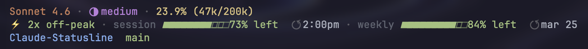

# Claude Statusline

A terminal statusline for [Claude Code](https://claude.ai/code) showing model, context usage, effort level, off-peak multiplier, and session/weekly quota bars.



## What it shows

**Line 1** — Model name · Effort level · Context window usage

**Line 2** — 2x off-peak indicator · Session quota bar · Weekly quota bar

**Line 3** — Project name · Git branch · Uncommitted diff (+/-)

## Install

```bash
npx @edceezz/claude-statusline
```

Requires `jq`:
```bash
brew install jq
```

Then restart Claude Code.

## Manual install

```bash
git clone https://github.com/fanyu/Claude-Statusline.git
cd Claude-Statusline
bash install.sh
```

## How it works

The script is installed to `~/.claude/statusline.sh` and registered in `~/.claude/settings.json` as the `statusLine` command. Claude Code calls it on every update, passing a JSON payload with model info, context usage, and cwd.

Quota data is fetched from the Anthropic API using your local OAuth token and cached for 5 minutes.

## Requirements

- macOS or Linux
- `jq`
- Claude Code with an active subscription
